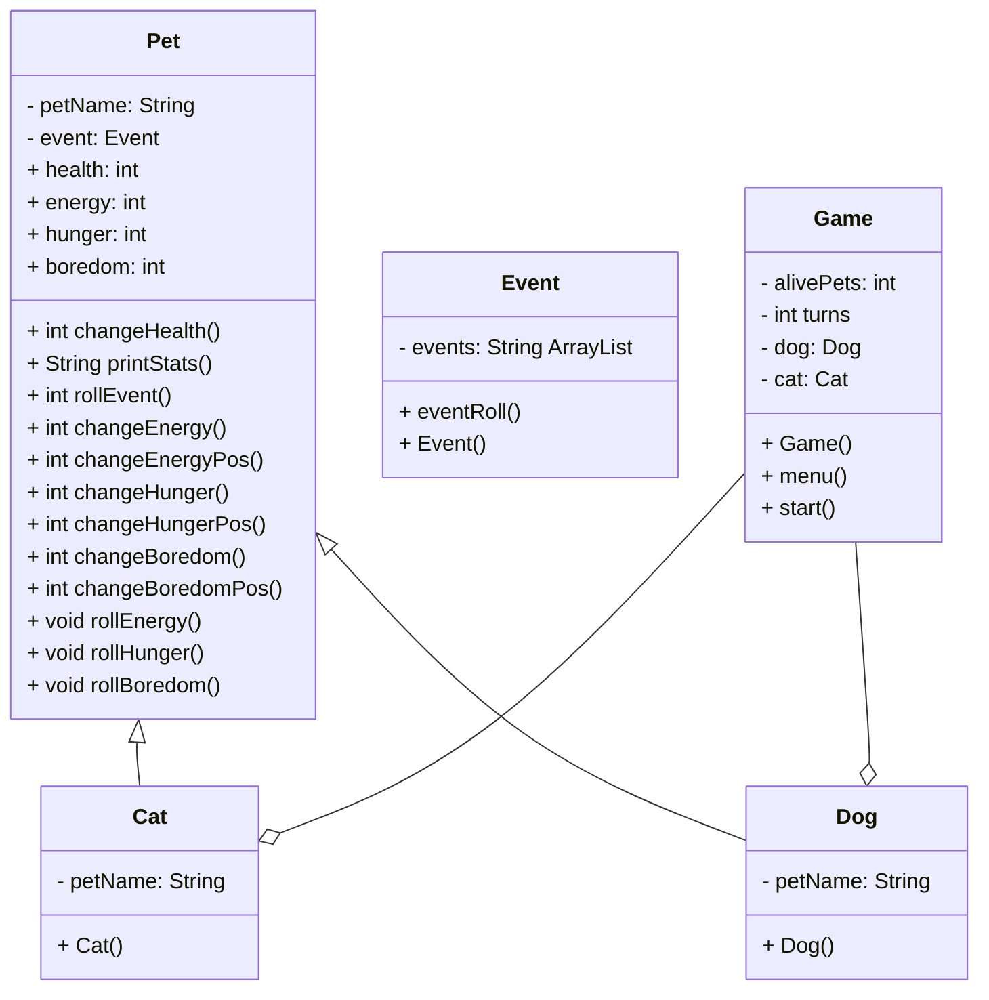

# FinalProjectF25

# UML

# Pet
private
    string petName
    Event event

public
    int health = 100
    int energy = 3
    int hunger = 3
    int boredom = 3

    int changeHealth(health)
        //Subtracts five from health if the stat is 0
        //I made it so it checks all 3 at once, that way if every stat was at 0, it wouldn't subtract 15
        //I did this so that it didn't punish the user too hard, especially if they get unlucky with stat rolls
        
        if energy <= 1 OR hunger <= 1 OR boredom <= 1
            subtract 5 from health
            set new health

        //I also made sure health cannot go below 0
        if health <= 0
            set health = 0   
    
    string printStats()
        //Prints all of the stats
        //First checks to make sure pet is alive
        //I didn't want dead pets to clutter the screen
        
        if health > 0
            print health/100
            print energy/3
            print hunger/3
            print boredom/3
            return ""
        else
            print petName "passed away"
         
    void rollEvent()
        //This one is basically just calling the random event from the Event.java
        //Then, based on what event it gets, it'll print the event and change stats
        
        string element = event.eventRoll() //puts the random event into a string
        print element
        
        if element = events.get(0) //This checks for the first event in the arrayList
            call changeBoredomPos(boredom, 2) //adds 2 to boredom
            call changeHungerPos(hunger, 2) //adds 2 to hunger
            call changeEnergy(energy, 1) //subtracts 2 from energy
        
        else if element = events.get(1) //Checks for the second event in the arrayList
            call changeBoredomPos(boredom, 2); //adds 2 to boredom
            call changeEnergyPos(energy, 2); //adds 2 to energy
        
        else if element = events.get(2) //Checks for third event in arrayList
            create an int for newHealth = health - 10
            set health
            //make sure health cannot go below 0
            if health <= 0
                newHealth = 0
                set health

        else if element = events.get(3) //Checks for fourth event in arrayList
            call changeHungerPos(hunger, 2) //adds 2 to hunger
        
        else if element = events.get(4) //Checks for fifth event in arrayList
            call changeBoredomPos(boredom, 2) //adds 2 to boredom
            call changeEnergy(energy, 1) //subtracts 1 from energy

        else if element = events.get(5) //Checks for sixth element in arrayList
            create an int for newHealth = health + 25
            set health
            //make sure health cannot go above 100
            if health >= 100
                newHealth = 100
                set health
        else 
            //If an event somehow got called that doesn't exist/isn't implemented 
            print Event error

    void changeEnergy(energy, number)
        //This subtracts the inputed number from energy 
        create an int for newEnergy = enery - number
        set energy
        //make sure stat cannot go below 0
        if energy <= 0
            newEnergy = 0
            set energy

    void changeEnergyPos(energy, number)
        //This adds the inputed number to energy
        create an int for newEnergy = energy + number
        set energy
        //make sure stat cannot go above 3
        if energy >= 3
            newEnergy = 3
            set energy

    void changeHunger(hunger, number)
        //This subtracts the inputed number from hunger
        create an int for newHunger = hunger - number
        set hunger
        //make sure stat cannot go below 0
        if hunger <= 0
            newHunger = 0
            set hunger
    
    void changeHungerPos(hunger, number)
        //This adds the inputed number to hunger
        create an int for newHunger = hunger + number
        set hunger
        //make sure stat cannot go above 3
        if hunger >= 3
            newHunger = 3
            set hunger

    void changeBoredom(boredom, number)
        //This subtracts the inputed number from boredom
        create an int for newBoredom = boredom - number
        set boredom
        //make sure stat cannot go under 0
        if boredom <= 0
            newBoredom = 0
            set boredom

    void changeBoredomPos(boredom, number)
        create an int for newBoredom = boredom + number
        set boredom
        //make sure stat cannot go above 3
        if boredom >= 3
            newBoredom = 3
            set boredom

    void rollEnergy(energy)
        //Rolls a random number between 1 and 2
        //If it's 1, energy will go down by 1
        //If it rolls 2, nothing will happen
        //I did this instead of making it go down if it's not chosen to increase by the user
        //Again, I didn't want to punish the user too much if they chose to feed instead of play for example
        create an int for randNumber and set that to chose between 1 and 2
        if randNumber = 1
            energy - 1
            print "Energy went down" //This is visually for the user
            set energy
        //make sure stat cannot go under 0
        if energy <= 0
            energy = 0
            set energy

    void rollHunger(hunger)
        //Again, rolls between 1 or 2, goes down if 1
        create an int for randNumber and randomize between 1 and 2
        if randNumber = 1
            hunger - 1
            print "Hunger went down"
            set hunger
        //make sure stat cannot go under 0
        if hunger <= 0
            hunger = 0
            set hunger    

    void rollBoredom(boredom)
        //Same as the last two
        create an int for randNumber and randomize between 1 and 2
        if randNumber = 1
            boredom - 1
            print "Boredom went down"
            set boredom
        //make sure stat cannot go under 0
        if boredom <= 0
            boredom = 0
            set boredom    

    int getHealth()
        return this.health

    void setHealth(health)
        this.health = health

    int getEnergy()
        return this.energy

    void setEnergy(energy)
        this.energy = energy

    int getHunger()
        return this.hunger

    void setHunger(hunger)
        this.hunger = hunger

    int getBoredom()
        return this.boredom

    void setBoredom(boredom)
        this.boredom = boredom

    string getPetName()
        return this.petName

    void setPetName(petName)
        this.petName = petName
        
# Dog
    private
        petName 
    
    public 
        Dog()
            

# Cat
    private
        string petName

    public Cat()

# Event
    private
        string ArrayList events

    public
        Event()
        
        String eventRoll()
            //Goes through the array and picks a random element from the array
            rand = new Random()
            create an int for randomIndex and randomize through the size of the array
            create a string for randomEvent and set that to events.get(randomIndex)
            return randomEvent
            //returns so that I can process it in pet class
# Game
    private
        int alivePets = 2 //I opted to only do 2 for visual reasons and because I didn't want to implement more than that.
        int turns = 0;
        Dog dog
        Cat cat

    public Game()
        start()

    public
        start()
            create a boolean keepGoing set to true
            while keepGoing
                create a string for response set to menu
                add 1 to turns
                check to make sure both or one pet is alive
                
                create an int for randEvent randomized between 1 and 2
                if randEven = 1
                    create an int for randNumber randomized between 1 and 2
                    //This choses between which pet will get the event - 1 for dog, 2 for cat
                    if randNumber = 1 AND dog health > 0 //Checks to make sure pet is alive, otherwise event won't play
                        print "Dog event: "
                        call dog.rollEvent()
                        print "New Dog Stats: ")
                        call dog.printStats()
                    else if randNumber = 2 AND cat health > 0
                        print "Cat event: "
                        call cat.rollEvent()
                        print "new Cat Stats: ")
                        call cat.printStats()
                
                if alive pets == 0 //checks to see if game is over
                    print "Game Over."
                    keepGoing = false.
                else 
                    create a string response set to menu
                   
                    if response = 0
                        call dog changeEnergyPos(energy, 1) //increases dog's energy
                        call the roll stats for other stats
                        call dog changeHealth() //checks to see if health needs subtracting
                        print "New dog stats"
                        call dog.printStats()

                        call cat changeEnergyPos(energy, 1)
                        call the roll stats for other stats
                        call cat changeHealth() //checks to see if health needs subtracting
                        print "New cat stats"
                        call cat.printStats()

                    else if response = 1
                        print Which pet?
                        0) Dog?
                        1) Cat?
                        create a string for secondResponse    
                        if secondResponse = 0
                            roll dog energy
                            add 1 to Dog hunger
                            add 1 to Dog boredom
                            call dog changeHealth
                            print new dog stats
                            
                            roll stats for all cat stats
                            call cat changeHealth
                            print new cat stats
                            
                        if secondResponse = 1
                            roll all dog stats
                            call dog changeHealth
                            print new dog stats
                    
                            roll energy
                            add 1 to hunger
                            add 1 to boredom
                            call cat changeHealth
                            print new cat stats

                        else 
                            print Invalid input

                    else if response = 2
                        print Which pet?
                        0) Dog?
                        1) Cat?
                        create a string for secondResponse        
                        if secondResponse = 0
                            roll dog energy and hunger
                            add 1 to dog boredom
                            call dog changeHealth
                            print new dog stats
                    
                            roll all cat stats
                            call cat changeHealth()
                            print new cat stats
    
                        if secondResponse = 1      
                            roll all dog stats
                            call dog changeHealth()
                            print new dog stats
            
                            roll cat energy and hunger
                            add 1 to cat boredom    
                            call cat changeHealth()
                            print new cat stats
                        else
                            print invalid input

                    else if response = 3
                        set keepGoing = false

                    else
                        print invalid input                      

        string menu()
            print 0) do nothing
            print 1) feed pet
            print 2) play with pet
            print 3) quit
            create an input for response
            return response 

