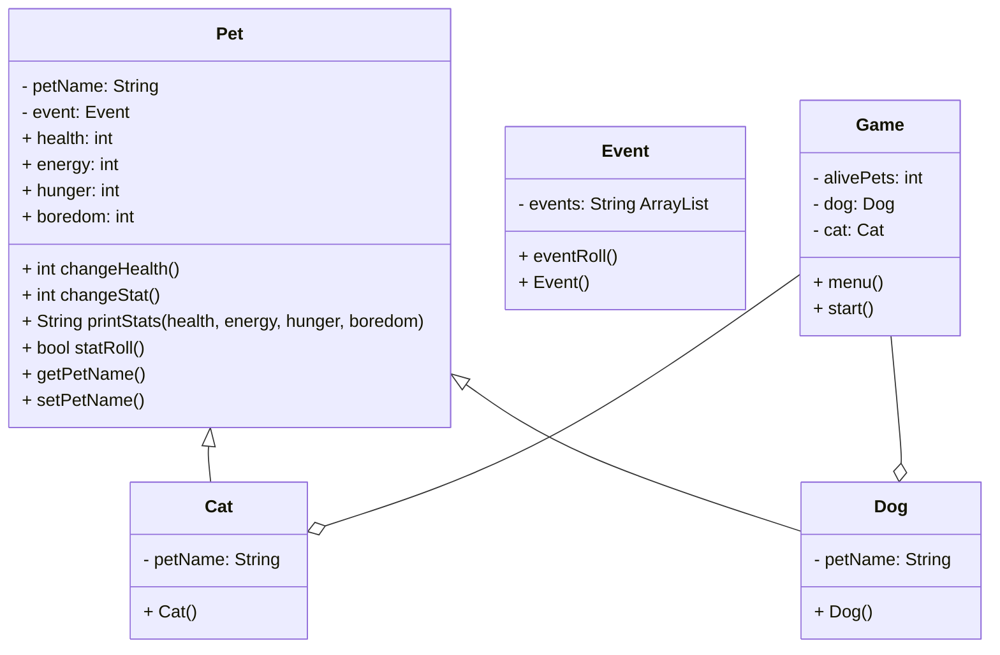

# FinalProjectF25

# UML

# Pet
private
    string petName
    Event event

public
    int health = 100
    int energy = 3
    int hunger = 3
    int boredom = 3

    int changeHealth(health)
        if energy = 1
            subtract 5 from health
            setHealth(health)

        if hunger = 1
            subtract 5 from health
            setHealth(health)

        if boredom = 1
            subtract 5 from health
            setHealth(health)        

    
    int changeStat()
        //not sure what to do with this right now
    
    
    string printStats(health, energy, hunger boredom)
        print health / 100
        if energy = 3
            print energy green
        if energy = 2
            print energy yellow
        if energy = 1
            print energy red
        else 
            print energy red
    
        if hunger = 3
            print hunger green
        if hunger = 2
            print hunger yellow
        if hunger = 1
            print hunger red
        else
            print hunger red

        if boredom = 3
            print boredom green
        if boredom = 2
            print boredom yellow
        if boredom = 1
            print boredom red
        else
            print boredom red

    int getHealth()
        return this.health

    void setHealth(health)
        this.health = health

    int getEnergy()
        return this.energy

    void setEnergy(energy)
        this.energy = energy

    int getHunger()
        return this.hunger

    void setHunger(hunger)
        this.hunger = hunger

    int getBoredom()
        return this.boredom

    void setBoredom(boredom)
        this.boredom = boredom

    string getPetName()
        return this.petName

    void setPetName(petName)
        this.petName = petName
        
# Dog
    private
        petName 
    
    public 
        Dog()
            

# Cat
    private
        string petName

    public Cat()

# Event
    private
        string ArrayList events

    public
        Event()
        
        EventRoll()
            if turns are divisible by two //this will only be able to be used in Game class
                chose a random event
            else
                do nothing

# Game
    private
        int alivePets = 2 //2 for now, might change to 3 later
        Dog dog
        Cat cat

    public
        start()
            create a boolean keepGoing set to true
                while keepGoing
                    create a string for response set to menu
                    add 1 to turns
                    eventRoll()
                    if alivePets < 1
                        print Game over
                        set keepGoing to false
                    else
                        if response = 0
                            subtract 1 from each stat
                            set each new stat
                        else if response = 1
                            print Which pet?
                            0) Dog?
                            1) Cat?
                            create a string for secondResponse    
                            if secondResponse = 0
                                add 1 to Dog hunger
                                add 1 to Dog boredom
                                subtract 1 from Cat stats
                                subtract 1 from Dog energy
                            else 
                                add 1 to Cat hunger
                                add 1 to Cat boredom
                                subtract 1 from Dog stats
                                subtract 1 from Cat energy
                        else if response = 2
                            print Which pet?
                            0) Dog?
                            1) Cat?
                            create a string for secondResponse        
                            if secondResponse = 0
                                add 1 to Dog boredom
                                subtract 1 from Cat stats
                                subtract 1 from Dog energy and hunger
                            else      
                                add 1 to Cat boredom
                                subtract 1 from Dog stats
                                subtract 1 from Cat energy and hunger
                        else
                            print invalid input                      

        string menu()
            print 0) do nothing
            print 1) feed pet
            print 2) play with pet
            create an input for response
            return response 

